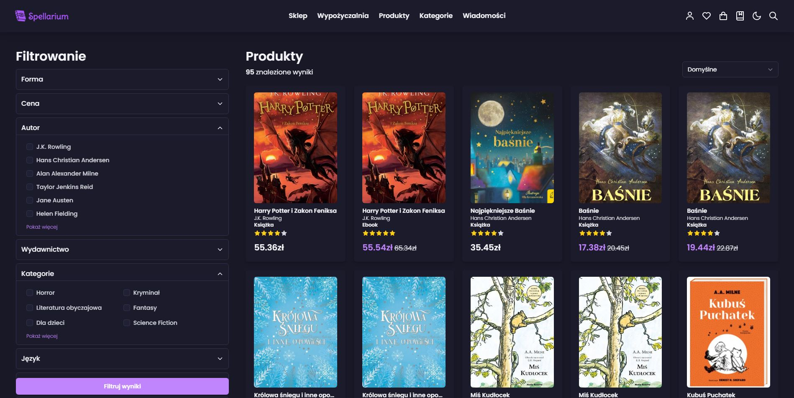
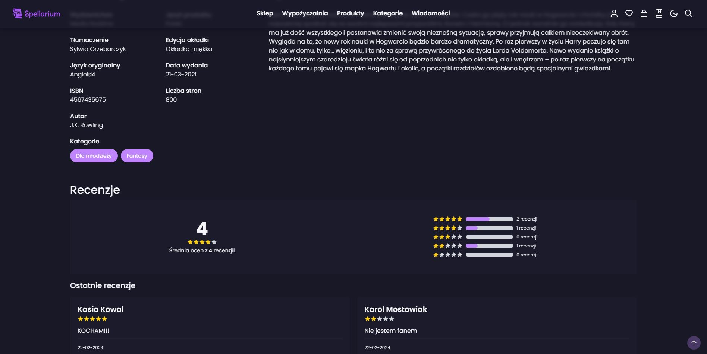
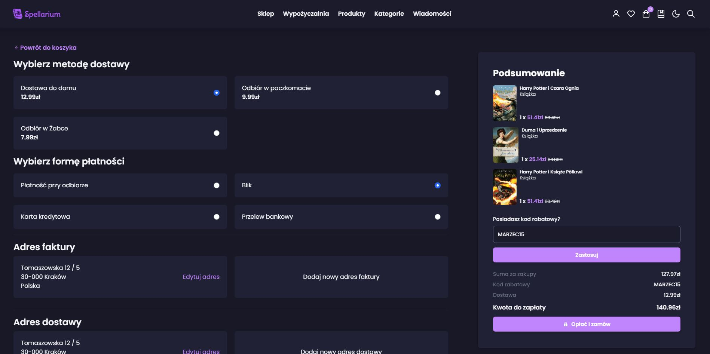
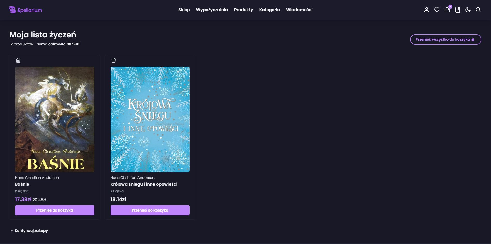
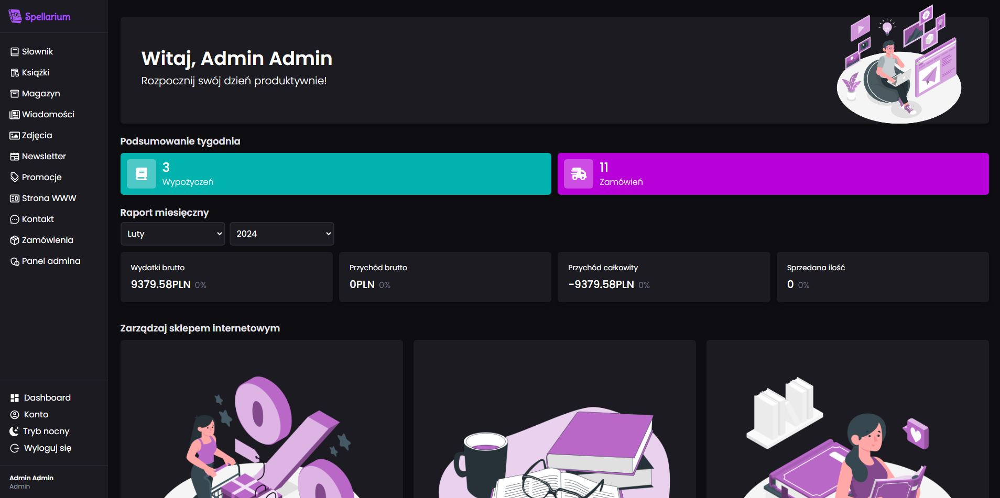
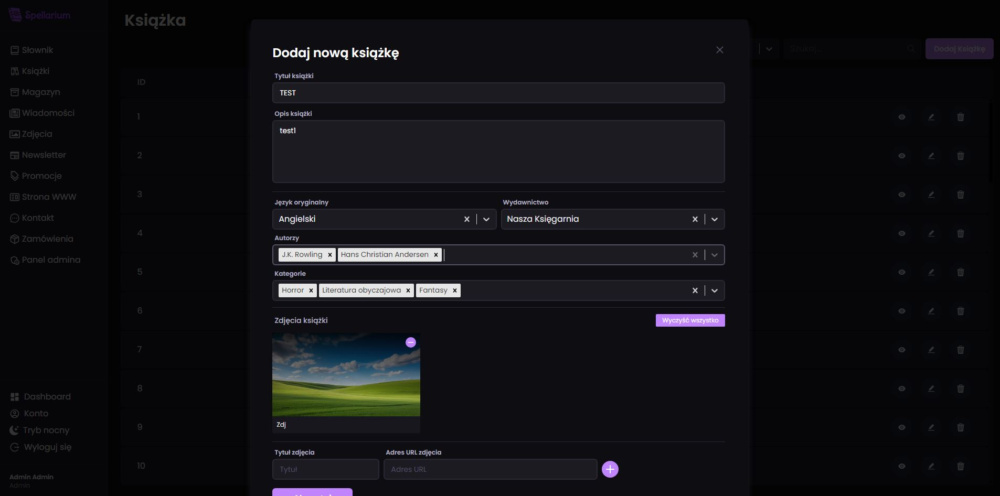
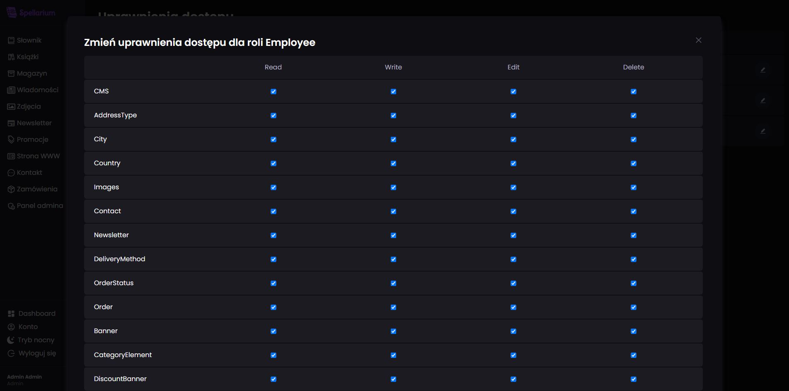
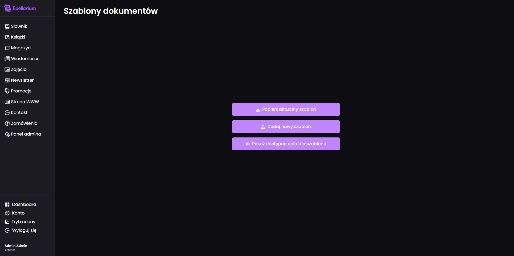
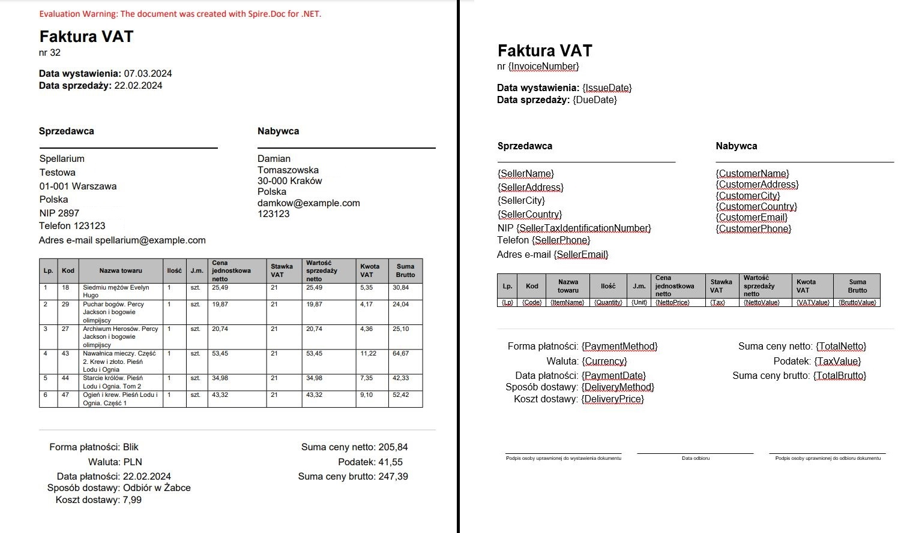

# BookStoreAPI
"BookStoreAPI" to interfejs API służący do zarządzania funkcjami sklepu internetowego oraz systemu CMS.

Frontend zaprezentowany w przykładzie został stworzony jako część tego samego projektu inżynierskiego, integrując się bezpośrednio z tym API.
Autor projektu frontendu to [https://github.com/kmilosia].

### Solucja składa się z:
- BookStoreAPI - główna aplikacja zawierająca kontrolery, serwisy obsługujące operacje bazodanowe oraz dodatkowe funkcje typu: generowanie dokumentów pdf na podstawie szablonu w docx
- BookStoreBusinessLogic - biblioteka klas zawierająca logikę biznesową
- BookStoreData - biblioteka klas zawierająca kontekst bazy danych oraz klasy reprezentujące tabele w bazie danych
- BookStoreDTO - biblioteka klas zawierająca modele DTO służące do mapowania obiektów

## Wykorzystane technologie:

### .NET:
8.0

### Język programowania: 
- C#

### Biblioteki i frameworki:
- ASP.NET Core
- Entity Framework Core
- Identity
- QuestPDF
- Spire.Doc

## Opis aplikacji:

### **Funkcje aplikacji:**
- Zarządzanie treścią:
  - Pełna możliwość modyfikowania treści (CRUD)
  - Dodawanie i nadawanie ról dla użytkowników
  - Modyfikowanie uprawnień dla ról
- Zarządzanie zamówieniami:
  - Realizacja zamówienia dla użytkowników z kontem oraz bez
  - Generowanie faktur w formacie PDF
- Klient
  - Autoryzacja i uwierzytelnianie
  - Recenzja zakupionych produktów
  - Modyfikowanie danych osobowych
  - Historia zamówień
- Sklep
  - Wyszukiwanie produktów na podstawie różnych kryteriów
  - Używanie kodów zniżkowych w koszyku
- Komunikacja
  - Subskrybcja newslettera
  - Wysyłanie wiadomości kontaktowych do sklepu za pomocą formularza
  - Wysyłanie wiadomości email do klienta

 ## Prezentacja funkcjonalności:

### Zdjęcia

Obraz 1. Strona główna.

----

Obraz 2. Sklep.

----

Obraz 3. Produkt 1.

Obraz 4. Produkt 2.

----

Obraz 5. Zamówienie.

----

Obraz 6. Wishlista.

----

Obraz 7. Strona główna w systemie CMS.

----

Obraz 8. Dodawanie nowego produktu w systemie CMS.

----

Obraz 9. Zarządzanie uprawnieniami w systemie CMS.

----

Obraz 10. Zarządzanie szablonami dokumentów w systemie CMS.

----

Obraz 11. Przykładowa faktura z szablonem.

----

### Wideo

 #### Sklep internetowy
 

----
 #### System CMS
 
